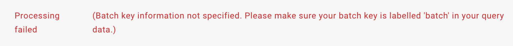

FAQs
=================

I am getting an error “Batch key information not specified…”
---------

If you are getting the error shown in the screenshot below when processing your query, this means that your query is missing batch information or you have not labelled your batch information correctly to "batch" in your .h5ad file. 
If your data is taken from a single sample and does not contain batch info or you are not sure how to relabel your batch info in you .h5ad file, you can make a copy of the following `notebook <https://colab.research.google.com/drive/11a-QpqPnBFvdB3ySQSZuoICXvuWKxQwm?usp=sharing/>`_ and run it, which will label your data as being from a single sample/batch or will relabel the batch info based on the name that you input for "custom_batch_name". 
After running this notebook you can upload the new .h5ad to ArchMap for mapping.

My query data has more than the limit of 200 000 cells. What can I do?
---------

Even if your query data has more than 200 000 cells, you are still able to map your full data to ArchMap by splitting your data into batches and creating separate projects for each mapping. After you have obtained your mapping results for each project, you can download your results on the "Your Mappings" page and concatenate your results. 
If you are not sure of the steps to take to do this, you can follow the linked notebooks that show how to correctly `separate <https://colab.research.google.com/drive/1-1kLHbo6sfvnOXKUbY49Nw3iCItIYky9?usp=sharing/>`_ you query pre-mapping and `concatenate <https://colab.research.google.com/drive/1voDJg4Yyz9yuubd76VaIn0fdKPsTJ6ue?usp=sharing/>`_ your results post-mapping. Please make sure to copy the notebooks in order to make any needed edits.

Which classifier should I use?
---------
We recommend to use the KNN classifier, as it performs the best for all atlases, specifically when transfering higher resolution cell type labels. 
However, we recommend that you consider the evaluation metric "Percentage query cells unknown" for the respective mapping on the "Your Mappings" page 
to evaluate the performance of a classifier in labelling your data. A cell will be labelled as "Unknown" if its uncertainty score is larger than 0.5.
If a large percentage of your query cells are labelled "Unknown" with your chosen classifier, we recommend to compare the label transfer with other available classifiers to determine if uncertainty can be improved.
Note that the number of query cells labelled "Unknown" is also dependent on the type of data you are mapping. 
For example, a disease dataset or mouse or cell line data mapped to the human lung cell atlas will have a higher number of "Unknown" cell type classifications 
than mapping healthy, human data. 

Where can I see the evaluation metrics?
---------
You can see the evaluation metrics of a mapping on the "Your Mappings" page by clicking on the information icon to the left of the CellxGene launch button.

Can I download my results?
---------
You can download your mapping results by clicking the download icon to the right of the CellxGene launch button on the "Your Mappings" page.

Where can I see the label transfer results?
---------
You can see the label transfer results by launching the CellxGene instance on the "Your mappings" page. 
For example if you chose the KNN classifier for label transfer when mapping to the human lung cell atlas, you will obtain cell type label transfer predictions for three levels of cell type annotations (ann_level_3, ann_level_4, ann_level_5).
For example for ann_level_5, the label transfer predictions will be found under categories ann_level_5_prediction_knn and ann_level_5_prediction_knn_filtered_by_uncert>0.5 (where cell types with an uncertainty score greater than 0.5 are labelled as "Unknown").

How can I interpret my label transfer results?
---------
Note the the label transfer results at the finest level for the fetal brain and hypomap atlases (that is, subregion_class and Author_CellType) may not be as accurate as the coarser layer predictions.

How can I visualize my downloaded results myself in cellxgene?
---------
To visualize your downloaded results yourself in cellxgene, you need to first install cellxgene locally. You can do so by following the steps `here <https://cellxgene.cziscience.com/docs/05__Annotate%20and%20Analyze%20Your%20Data/5_1__Getting%20Started:%20Install,%20Launch,%20Quick%20Start>`_.
ArchMap's built-in visualization functionality includes only a subset of the original reference to allow for faster computation. Hence, the neighbourhood graph of the downloaded file containing the full mapping must be recomputed if visualization is desired downstream using cellxgene.
You can use the colab notebook `here <https://colab.research.google.com/drive/1CxyNutNUjK3SSLJbxhj_Gg89FO4Rr5EO?usp=sharing>`_ to recalculate the neighbourhood graph of your mapping. Please make sure to copy the notebook in order to make any needed edits. Once you have run the notebook, you can visualize the output file by launching cellxgene in your terminal, as shown `here <https://cellxgene.cziscience.com/docs/05__Annotate%20and%20Analyze%20Your%20Data/5_1__Getting%20Started:%20Install,%20Launch,%20Quick%20Start>`_.

Why can I not submit more than 40 projects at once?
---------
A limit of 40 projects per hour is set for each user. Thus, if you try to submit further projects within an hour, the newly submitted project will not show up on your project dashboard. This limit will reset after an hour.

How can I map my data to an older version of a model on scvi-hub?
---------
To map to an older version of a model on scvi-hub, the user can follow this `tutorial <https://drive.google.com/file/d/155fYroA0aCa9IUl80rvzy9L2RY_Hd1aT/view?usp=sharing>`_ to download their desired scvi-hub model (with specified version) and upload it to ArchMap to map their query to.

How do I upload a scPoli model to ArchMap:
---------
To upload a scPoli model to ArchMap, please follow the tutorial provided `here <https://drive.google.com/file/d/1f-RH-4bU4UeTu5HVTB1e1ySYwdCyFf3F/view?usp=sharing>`_. As the scPoli output after integration generates three separate files, it is necessary to combine these files to upload to ArchMap. The necessary steps are outlined in the linked tutorial.