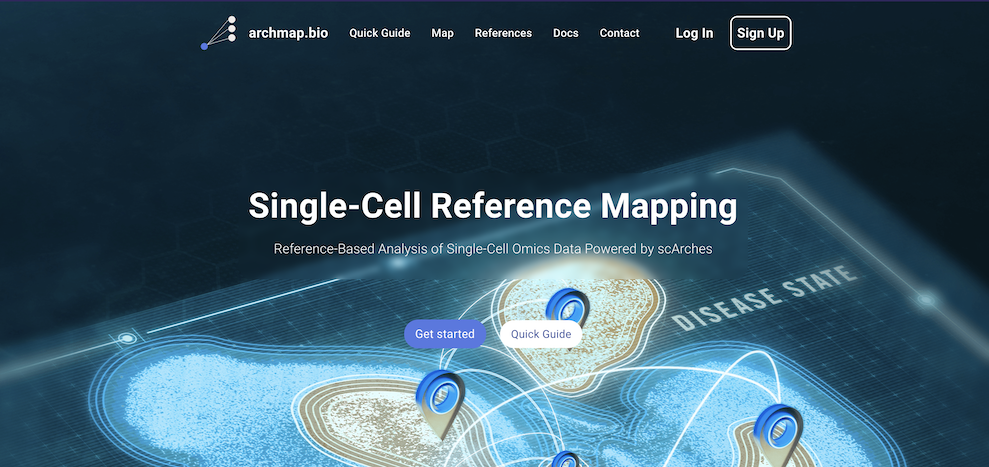
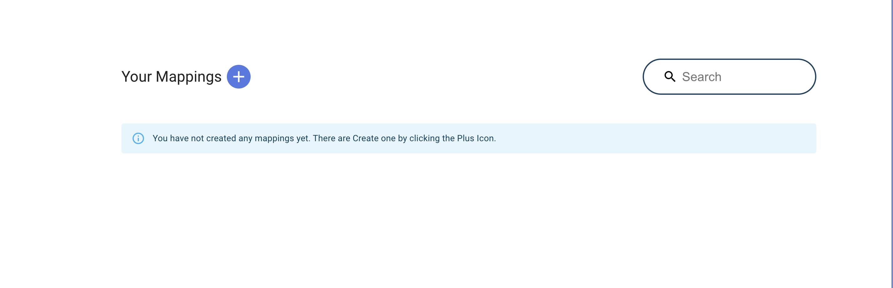
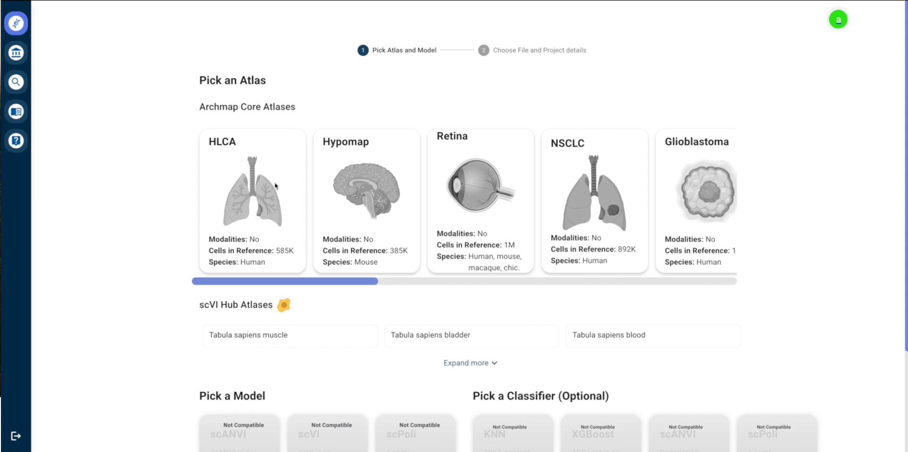
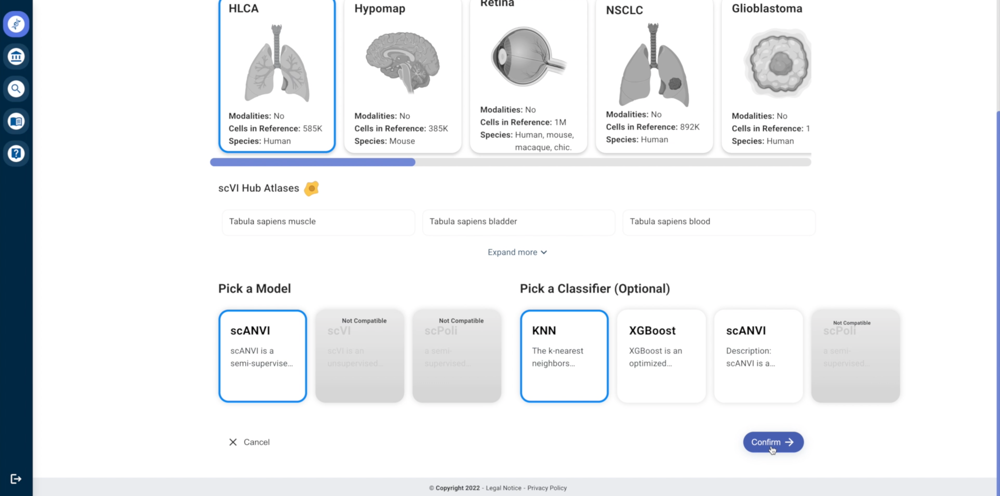
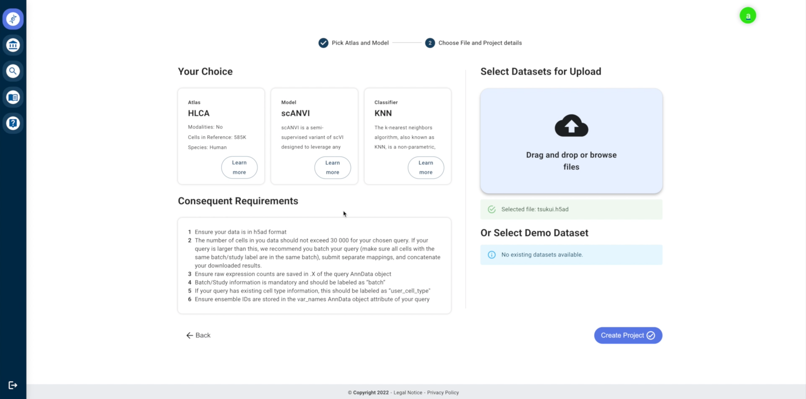
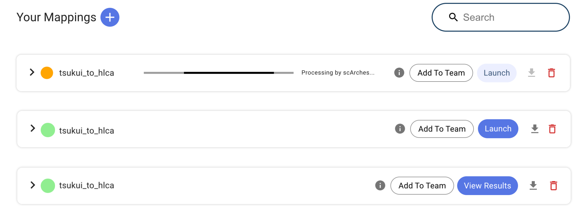
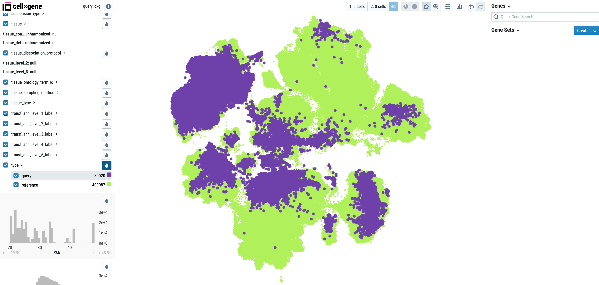
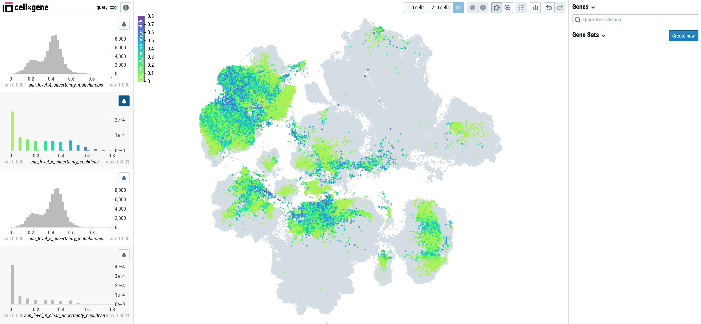
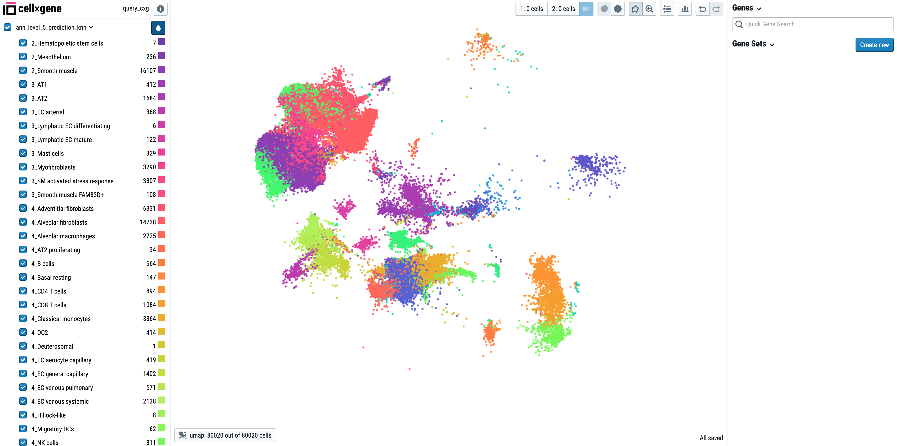

.. include:: README.rst

First steps
---------

First login or sign up using your academic affiliation. Click on "Map" to go straight to mapping your data without logging in.

Click on the plus button to create a new mapping project.

On the page below you can pick a reference atlas you want to map your data to and the model associated with this atlas.
Please note that some models are not compatible with some atlases. If so, they will be disabled. You can also choose a classifier for cell type label transfer of reference cell types to your query data. 
Available classifiers include KNN, XGBoost, and the native classifiers for scANVI and scVI, if applicable.

After selecting your atlas, model, and classifier, you can then upload your query data by drag-and-drop or by clicking on the upload field. In order to map your data successfully, **please follow the instructions on the left of the upload page!** 

Once your data is uploaded, click on "Create Mapping", give your project an appropriate name, and submit.
You will then be forwarded back to the homepage where you can eventually review the result once it is done processing.
Please note that it takes some time to process, depending on the size of the query data (no longer than one hour). Please wait until both the launch button and download button is clickable before launching a CellxGene Annotate instance. Once clicking on "Launch", a color-coded build status will appear to notify that a CellxGene instance is loading. Once fully loaded, a "View Results" button will appear.
Clicking on this button will open CellxGene in a new tab, where a UMAP of your combined mapping can be viewed.

You can also view mapping info and all evaluation metrics calculated by ArchMap for each mapping by clicking on the info icon to the left of the "Launch" button (if you are logged in, this will be to the left of the "Add To Team" button). For more information on how to interpret the evaluation metrics, checkout the "Mapping evaluation" page.

 .. image:: _static/evaluation_metrics.png

Once the CellxGene page is loaded, you can view the UMAP of the combined query and reference. The cells of the UMAP can be coloured using the toggleable categorical and contionuous variables on the left. For example, you can colour based on the cell type label predictions, query vs reference cells, and the uncertainty scores assigned to the query.
Additionally, you can create new categories, subset your cells and conduct differential gene expression analysis. You can read more about the functionalities of CellxGene Annotate `here <https://cellxgene.cziscience.com/docs/05__Annotate%20and%20Analyze%20Your%20Data/5_0__Get%20Started/>`_. In the screenshot below, you see the UMAP coloured by query and reference:

Below, we colour the query cells based on the Euclidean uncertainty scores assigned to each cell post-mapping.

We can also subset to strictly the query cells and colour by the cell type labels assigned by the KNN classifier. The cell type classification results are saved under the columns that end with "prediction_knn" (or "prediction_xgboost" if the XGBoost classifier is selected) and "prediction_knn_filtered_by_uncert>0.5". 
For example, for the HLCA, the label transfer using the "ann_level_5" annotation level of the reference atlas will output the columns "ann_level_5_prediction_knn" and "ann_level_5_prediction_knn_filtered_by_uncert>0.5", where cell types with an uncertainty score greater than 0.5 are labelled as "Unknown" in the second column.

Check out a short tutorial video of the mapping process here:

 .. raw:: html

   <video width="820" height="640" controls src="_static/archmap_video.mp4"></video>   

.. note::

   This project is under active development. If you come across any issues, please write an email to archmap.bio@gmail.com.

Links To The Detailed Information Pages
---------

.. toctree::

   Home <self>
   visualization/index.rst
   beta_feature/index.rst
   faqs/index.rst
